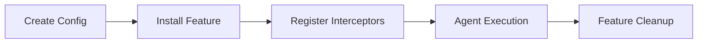

## Overview

Koog's **feature system** provides a powerful extension mechanism for adding custom functionality to AI agents. Features can intercept agent lifecycle events, modify behavior, and add new capabilities without modifying core agent code.

## Feature Architecture

### AIAgentFeature Interface

All features implement one or more of these interfaces:

```kotlin
// Base interface
interface AIAgentFeature<TConfig : FeatureConfig, TFeatureImpl : Any> {
    val key: AIAgentStorageKey<TFeatureImpl>
    fun createInitialConfig(): TConfig
}

// For graph-based agents
interface AIAgentGraphFeature<TConfig : FeatureConfig, TFeatureImpl : Any> 
    : AIAgentFeature<TConfig, TFeatureImpl> {
    fun install(config: TConfig, pipeline: AIAgentGraphPipeline): TFeatureImpl
}

// For functional agents
interface AIAgentFunctionalFeature<TConfig : FeatureConfig, TFeatureImpl : Any> 
    : AIAgentFeature<TConfig, TFeatureImpl> {
    fun install(config: TConfig, pipeline: AIAgentFunctionalPipeline): TFeatureImpl
}

// For planner agents
interface AIAgentPlannerFeature<TConfig : FeatureConfig, TFeatureImpl : Any> 
    : AIAgentFeature<TConfig, TFeatureImpl> {
    fun install(config: TConfig, pipeline: AIAgentPlannerPipeline): TFeatureImpl
}
```

### Feature Lifecycle



## Creating a Simple Feature

### Step 1: Define Feature Configuration

```kotlin
class MetricsConfig : FeatureConfig() {
    var trackTokenUsage: Boolean = true
    var trackLatency: Boolean = true
    var metricsCollector: MetricsCollector? = null
    
    fun collector(collector: MetricsCollector) {
        this.metricsCollector = collector
    }
}
```

### Step 2: Implement Feature Class

```kotlin
class Metrics {
    companion object Feature : 
        AIAgentGraphFeature<MetricsConfig, Metrics>,
        AIAgentFunctionalFeature<MetricsConfig, Metrics> {
        
        override val key = AIAgentStorageKey<Metrics>("custom-metrics")
        
        override fun createInitialConfig() = MetricsConfig()
        
        override fun install(
            config: MetricsConfig,
            pipeline: AIAgentGraphPipeline
        ): Metrics {
            val metrics = Metrics()
            val collector = config.metricsCollector 
                ?: throw IllegalStateException("Metrics collector not configured")
            
            // Track LLM call latency
            if (config.trackLatency) {
                pipeline.interceptLLMCallStarting(this) {
                    val startTime = Clock.System.now()
                    storage.set(createStorageKey("start_time"), startTime)
                }
                
                pipeline.interceptLLMCallCompleted(this) {
                    val startTime = storage.get<Instant>(createStorageKey("start_time"))
                    val duration = Clock.System.now() - startTime!!
                    collector.recordLatency(duration)
                }
            }
            
            // Track token usage
            if (config.trackTokenUsage) {
                pipeline.interceptLLMCallCompleted(this) { context ->
                    context.responses.forEach { response ->
                        when (response) {
                            is Message.Assistant -> {
                                collector.recordTokens(
                                    prompt = context.prompt.messages.size,
                                    completion = response.content.length
                                )
                            }
                        }
                    }
                }
            }
            
            return metrics
        }
        
        override fun install(
            config: MetricsConfig,
            pipeline: AIAgentFunctionalPipeline
        ): Metrics {
            // Similar implementation for functional agents
            return Metrics()
        }
    }
}
```

### Step 3: Use Your Feature

```kotlin
val agent = AIAgent("metrics-agent") {
    install(Metrics) {
        trackTokenUsage = true
        trackLatency = true
        collector(MyMetricsCollector())
    }
    
    // Rest of agent configuration
}
```

## Advanced Feature Patterns

### Pattern 1: State Management

Features can maintain state across agent executions:

```kotlin
class ConversationHistory {
    private val conversations = mutableMapOf<String, MutableList<Message>>()
    
    companion object Feature : AIAgentGraphFeature<HistoryConfig, ConversationHistory> {
        override val key = AIAgentStorageKey<ConversationHistory>("conversation-history")
        
        override fun createInitialConfig() = HistoryConfig()
        
        override fun install(
            config: HistoryConfig,
            pipeline: AIAgentGraphPipeline
        ): ConversationHistory {
            val history = ConversationHistory()
            
            // Load history at strategy start
            pipeline.interceptStrategyStarting(this) { context ->
                val conversationId = context.runId
                val messages = history.conversations[conversationId] ?: emptyList()
                
                context.llm.writeSession {
                    prompt = prompt.withMessages { existing -> messages + existing }
                }
            }
            
            // Save history at strategy completion
            pipeline.interceptStrategyCompleted(this) { context ->
                val conversationId = context.runId
                history.conversations[conversationId] = 
                    context.llm.prompt.messages.toMutableList()
            }
            
            return history
        }
    }
}
```

### Pattern 2: Message Transformation

Modify messages before they reach the LLM:

```kotlin
class ContentFilter {
    companion object Feature : AIAgentGraphFeature<FilterConfig, ContentFilter> {
        override val key = AIAgentStorageKey<ContentFilter>("content-filter")
        
        override fun createInitialConfig() = FilterConfig()
        
        override fun install(
            config: FilterConfig,
            pipeline: AIAgentGraphPipeline
        ): ContentFilter {
            val filter = ContentFilter()
            
            pipeline.interceptLLMCallStarting(this) { context ->
                // Filter messages before sending to LLM
                val filteredMessages = context.prompt.messages.map { message ->
                    when (message) {
                        is Message.User -> {
                            message.copy(
                                content = config.filterFunction(message.content)
                            )
                        }
                        else -> message
                    }
                }
                
                context.context.llm.writeSession {
                    prompt = prompt.withMessages { filteredMessages }
                }
            }
            
            return filter
        }
    }
}
```

### Pattern 3: Error Recovery

Handle failures gracefully:

```kotlin
class ErrorRecovery {
    companion object Feature : AIAgentGraphFeature<RecoveryConfig, ErrorRecovery> {
        override val key = AIAgentStorageKey<ErrorRecovery>("error-recovery")
        
        override fun createInitialConfig() = RecoveryConfig()
        
        override fun install(
            config: RecoveryConfig,
            pipeline: AIAgentGraphPipeline
        ): ErrorRecovery {
            val recovery = ErrorRecovery()
            
            pipeline.interceptLLMCallFailed(this) { context ->
                val error = context.error
                
                // Attempt recovery based on error type
                when {
                    error.message?.contains("rate limit") == true -> {
                        delay(config.retryDelay)
                        // Signal retry
                    }
                    error.message?.contains("timeout") == true -> {
                        // Switch to fallback model
                        context.context.llm.writeSession {
                            config = config.copy(model = config.fallbackModel)
                        }
                    }
                    else -> {
                        // Log and propagate
                        config.errorLogger?.log(error)
                    }
                }
            }
            
            return recovery
        }
    }
}
```

### Pattern 4: Multi-Agent Coordination

Coordinate between multiple agents:

```kotlin
class AgentCoordination {
    private val activeAgents = mutableMapOf<String, AgentState>()
    
    companion object Feature : AIAgentGraphFeature<CoordinationConfig, AgentCoordination> {
        override val key = AIAgentStorageKey<AgentCoordination>("agent-coordination")
        
        override fun createInitialConfig() = CoordinationConfig()
        
        override fun install(
            config: CoordinationConfig,
            pipeline: AIAgentGraphPipeline
        ): AgentCoordination {
            val coordination = AgentCoordination()
            
            pipeline.interceptAgentStarting(this) { context ->
                coordination.activeAgents[context.agentId] = AgentState.Running
                config.coordinator?.notifyAgentStarted(context.agentId)
            }
            
            pipeline.interceptAgentCompleted(this) { context ->
                coordination.activeAgents[context.agentId] = AgentState.Completed
                config.coordinator?.notifyAgentCompleted(context.agentId)
            }
            
            return coordination
        }
    }
}
```

## Pipeline Integration

### Available Interceptors

Features can intercept these lifecycle events:

#### Agent Lifecycle
```kotlin
pipeline.interceptAgentStarting(feature) { context -> /* ... */ }
pipeline.interceptAgentCompleted(feature) { context -> /* ... */ }
pipeline.interceptAgentExecutionFailed(feature) { context -> /* ... */ }
pipeline.interceptAgentClosing(feature) { context -> /* ... */ }
```

#### Strategy Lifecycle
```kotlin
pipeline.interceptStrategyStarting(feature) { context -> /* ... */ }
pipeline.interceptStrategyCompleted(feature) { context -> /* ... */ }
```

#### Node Execution (Graph Agents)
```kotlin
pipeline.interceptNodeExecutionStarting(feature) { context -> /* ... */ }
pipeline.interceptNodeExecutionCompleted(feature) { context -> /* ... */ }
pipeline.interceptNodeExecutionFailed(feature) { context -> /* ... */ }
```

#### Subgraph Execution (Graph Agents)
```kotlin
pipeline.interceptSubgraphExecutionStarting(feature) { context -> /* ... */ }
pipeline.interceptSubgraphExecutionCompleted(feature) { context -> /* ... */ }
pipeline.interceptSubgraphExecutionFailed(feature) { context -> /* ... */ }
```

#### LLM Calls
```kotlin
pipeline.interceptLLMCallStarting(feature) { context -> /* ... */ }
pipeline.interceptLLMCallCompleted(feature) { context -> /* ... */ }
pipeline.interceptLLMCallFailed(feature) { context -> /* ... */ }
```

#### Tool Execution
```kotlin
pipeline.interceptToolCallStarting(feature) { context -> /* ... */ }
pipeline.interceptToolCallCompleted(feature) { context -> /* ... */ }
pipeline.interceptToolCallFailed(feature) { context -> /* ... */ }
pipeline.interceptToolValidationFailed(feature) { context -> /* ... */ }
```

## Feature Configuration

### Configuration DSL

```kotlin
class MyFeatureConfig : FeatureConfig() {
    var setting1: String = "default"
    var setting2: Int = 10
    private val handlers = mutableListOf<Handler>()
    
    fun addHandler(handler: Handler) {
        handlers.add(handler)
    }
    
    fun eventFilter(filter: (AgentLifecycleEventContext) -> Boolean) {
        setEventFilter(filter)
    }
}

// Usage
install(MyFeature) {
    setting1 = "custom"
    setting2 = 20
    addHandler(MyHandler())
    
    // Only process events for specific agents
    eventFilter { context ->
        context.agentId.startsWith("prod-")
    }
}
```

### Event Filtering

Control which events your feature processes:

```kotlin
class SelectiveFeature {
    companion object Feature : AIAgentGraphFeature<SelectiveConfig, SelectiveFeature> {
        override fun install(
            config: SelectiveConfig,
            pipeline: AIAgentGraphPipeline
        ): SelectiveFeature {
            // Set event filter in configuration
            config.setEventFilter { context ->
                // Only process events from production agents
                context.agentId.startsWith("prod-")
            }
            
            // Interceptors will only fire for filtered events
            pipeline.interceptLLMCallCompleted(this) { context ->
                // Only called for prod-* agents
            }
            
            return SelectiveFeature()
        }
    }
}
```

## Testing Custom Features

### Unit Testing

```kotlin
class MetricsFeatureTest {
    @Test
    fun `should track token usage`() = runTest {
        val collector = TestMetricsCollector()
        
        val agent = AIAgent("test") {
            install(Metrics) {
                trackTokenUsage = true
                collector(collector)
            }
            
            // Mock LLM
            withMockExecutor(toolRegistry) {
                mockLLMAnswer("Response") onRequestContains "test"
            }
        }
        
        agent.execute("test input")
        
        assertTrue(collector.tokenCalls > 0)
    }
}
```

### Integration Testing

```kotlin
class FeatureIntegrationTest {
    @Test
    fun `features should not conflict`() = runTest {
        val agent = AIAgent("test") {
            install(Metrics) { /* ... */ }
            install(Tracing) { /* ... */ }
            install(ChatMemory) { /* ... */ }
        }
        
        // All features should work together
        val result = agent.execute("test")
        assertNotNull(result)
    }
}
```

## Best Practices

### 1. Use Unique Storage Keys

```kotlin
// ✅ Good: Unique, descriptive key
override val key = AIAgentStorageKey<MyFeature>("com.company.my-feature")

// ❌ Bad: Generic key may collide
override val key = AIAgentStorageKey<MyFeature>("feature")
```

### 2. Clean Up Resources

```kotlin
pipeline.interceptAgentClosing(this) { context ->
    // Release resources
    httpClient.close()
    database.disconnect()
}
```

### 3. Handle Errors Gracefully

```kotlin
pipeline.interceptLLMCallCompleted(this) { context ->
    try {
        processResponse(context.responses)
    } catch (e: Exception) {
        logger.error(e) { "Feature processing failed" }
        // Don't propagate unless critical
    }
}
```

### 4. Document Configuration Options

```kotlin
/**
 * Configuration for the Metrics feature.
 *
 * @property trackTokenUsage Enable token usage tracking
 * @property trackLatency Enable latency tracking
 * @property metricsCollector Collector for metrics data (required)
 */
class MetricsConfig : FeatureConfig() {
    // ...
}
```

### 5. Support Multiple Agent Types

```kotlin
companion object Feature :
    AIAgentGraphFeature<Config, Feature>,
    AIAgentFunctionalFeature<Config, Feature>,
    AIAgentPlannerFeature<Config, Feature> {
    
    // Share implementation when possible
    private fun installCommon(
        config: Config,
        pipeline: AIAgentPipeline
    ): Feature {
        // Common logic
    }
}
```

## Examples

See built-in features for reference implementations:

- **Memory**: `agents/agents-features/agents-features-memory` - Chat history persistence
- **Tracing**: `agents/agents-features/agents-features-trace` - Debug tracing
- **OpenTelemetry**: `agents/agents-features/agents-features-opentelemetry` - Production observability
- **Event Handler**: `agents/agents-features/agents-features-event-handler` - Custom event processing

## Resources

- [Feature API Reference](/api/features)
- [Built-in Features](/features/overview)
- [Pipeline Documentation](/core-concepts/pipeline)
- [Testing Guide](/testing/features)