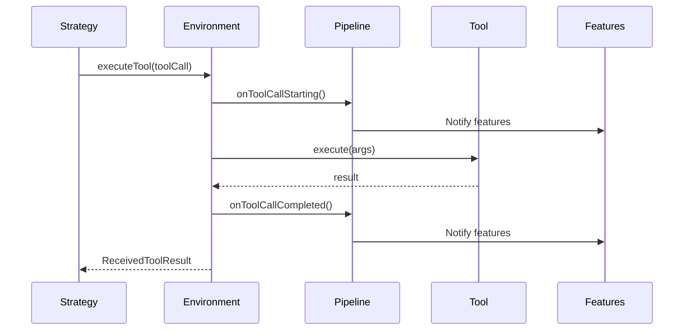

## Overview

`AIAgentEnvironment` provides a controlled mechanism for AI agents to interface with external tools and report problems. It ensures that tool execution happens within a safe, monitored context.

<Warning>
  Tools should only be executed through the environment interface, not called directly. Direct tool calls bypass feature pipelines, event handlers, and testing infrastructure.
</Warning>

## Interface Definition

```kotlin
public interface AIAgentEnvironment
```

## Methods

### executeTool

Executes a single tool call and returns its result.

```kotlin
public suspend fun executeTool(
    toolCall: Message.Tool.Call
): ReceivedToolResult
```

<ParamField path="toolCall" type="Message.Tool.Call" required>
  A tool call message containing:
  - Tool identifier
  - Tool name
  - Request content (arguments)
  - Associated metadata
</ParamField>

<ResponseField name="return" type="ReceivedToolResult">
  The result of executing the tool call, including:
  - Tool name
  - Tool identifier
  - Response content
  - Associated metadata
</ResponseField>

### executeTools

Executes multiple tool calls in parallel and processes their results.

```kotlin
public suspend fun executeTools(
    toolCalls: List<Message.Tool.Call>
): List<ReceivedToolResult>
```

<ParamField path="toolCalls" type="List<Message.Tool.Call>" required>
  A list of tool call messages to be executed concurrently
</ParamField>

<ResponseField name="return" type="List<ReceivedToolResult>">
  A list of results corresponding to the executed tool calls, in the same order
</ResponseField>

<Note>
  The default implementation uses `supervisorScope` to execute tools in parallel with proper error handling. Individual tool failures are isolated and don't affect other tool executions.
</Note>

### reportProblem

Reports a problem that occurred within the environment.

```kotlin
public suspend fun reportProblem(
    exception: Throwable
)
```

<ParamField path="exception" type="Throwable" required>
  The exception representing the problem to report. This is used to handle errors encountered during agent execution.
</ParamField>

<Note>
  Problem reporting is integrated with the agent's feature pipeline, allowing features to intercept and handle errors.
</Note>

## Usage Examples

### Executing a Tool in a Strategy

```kotlin
class MyStrategy : AIAgentGraphStrategy<String, String> {
    override val name = "my-strategy"
    
    override suspend fun execute(
        context: AIAgentGraphContext,
        input: String
    ): String? {
        // Get LLM to decide which tools to use
        val response = context.llm.prompt {
            user(input)
        }.execute()
        
        // Execute tools through the environment
        if (response is Message.Assistant.ToolCall) {
            val toolCall = response.toolCalls.first()
            
            // Use environment to execute the tool
            val result = context.environment.executeTool(toolCall)
            
            return "Tool executed: ${result.content}"
        }
        
        return response.content
    }
}
```

### Batch Tool Execution

```kotlin
suspend fun processBatchTools(
    environment: AIAgentEnvironment,
    toolCalls: List<Message.Tool.Call>
) {
    // Execute all tools in parallel
    val results = environment.executeTools(toolCalls)
    
    // Process results
    results.forEach { result ->
        println("Tool ${result.toolName}: ${result.content}")
    }
}
```

### Error Handling with reportProblem

```kotlin
class SafeStrategy : AIAgentGraphStrategy<String, String> {
    override val name = "safe-strategy"
    
    override suspend fun execute(
        context: AIAgentGraphContext,
        input: String
    ): String? {
        return try {
            val response = context.llm.prompt {
                user(input)
            }.execute()
            
            response.content
        } catch (e: Exception) {
            // Report the problem through the environment
            context.environment.reportProblem(e)
            
            // Return fallback response
            "An error occurred: ${e.message}"
        }
    }
}
```

### Conditional Tool Execution

```kotlin
suspend fun executeToolsConditionally(
    environment: AIAgentEnvironment,
    response: Message.Assistant
) {
    when (response) {
        is Message.Assistant.ToolCall -> {
            // Execute all requested tools
            val results = environment.executeTools(response.toolCalls)
            
            // Send results back to LLM
            processToolResults(results)
        }
        is Message.Assistant.Text -> {
            // No tools needed, use text response
            println(response.content)
        }
    }
}
```

## Tool Execution Flow



## Environment Context

The environment is available through the agent context:

```kotlin
// In a strategy
override suspend fun execute(
    context: AIAgentGraphContext,
    input: String
): String? {
    // Access environment from context
    val environment = context.environment
    
    // Execute tools safely
    val result = environment.executeTool(toolCall)
    
    return result.content
}
```

## SafeTool Wrapper

For type-safe tool access, use the SafeTool wrapper:

```kotlin
// Get a safe tool wrapper
val safeTool = context.environment.findTool(MyTool::class)

// Execute with typed arguments
val result = safeTool.execute(MyTool.Args(
    query = "search query"
))
```

## Advanced: Custom Environment

You can implement custom environments for testing or special behavior:

```kotlin
class LoggingEnvironment(
    private val delegate: AIAgentEnvironment
) : AIAgentEnvironment {
    override suspend fun executeTool(
        toolCall: Message.Tool.Call
    ): ReceivedToolResult {
        println("Executing tool: ${toolCall.name}")
        
        val result = delegate.executeTool(toolCall)
        
        println("Tool result: ${result.content}")
        return result
    }
    
    override suspend fun executeTools(
        toolCalls: List<Message.Tool.Call>
    ): List<ReceivedToolResult> {
        println("Executing ${toolCalls.size} tools in parallel")
        return delegate.executeTools(toolCalls)
    }
    
    override suspend fun reportProblem(exception: Throwable) {
        println("Problem reported: ${exception.message}")
        delegate.reportProblem(exception)
    }
}
```

## Best Practices

<Note>
  **Tool Execution**
  
  - Always use the environment interface for tool execution
  - Never call `tool.execute()` directly in agent code
  - Use `executeTools()` for parallel execution when possible
  - Handle tool results appropriately in your strategy
</Note>

<Warning>
  **Error Handling**
  
  - Use `reportProblem()` to report errors to the agent pipeline
  - Don't swallow exceptions without reporting them
  - Features and event handlers depend on proper error reporting
  - Consider retry logic for transient tool failures
</Warning>

## Testing

Mock environments for testing:

```kotlin
val mockEnvironment = object : AIAgentEnvironment {
    override suspend fun executeTool(
        toolCall: Message.Tool.Call
    ): ReceivedToolResult {
        return ReceivedToolResult(
            toolName = toolCall.name,
            content = "mocked result"
        )
    }
    
    override suspend fun reportProblem(exception: Throwable) {
        // Log for test verification
        println("Test: Problem reported: ${exception.message}")
    }
}
```

## Related Types

- [AIAgent](/api/ai-agent) - Uses environment for tool execution
- [AIAgentStrategy](/api/ai-agent-strategy) - Accesses environment through context
- [Tool](/api/tool) - Executed through the environment
- [ToolRegistry](/api/tool-registry) - Tools available in the environment

## Source Reference

Defined in: `agents-core/src/commonMain/kotlin/ai/koog/agents/core/environment/AIAgentEnvironment.kt`
