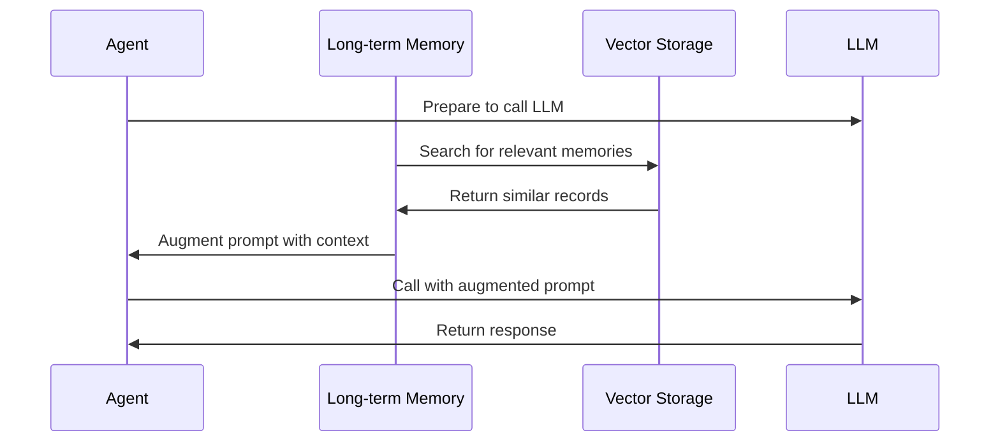
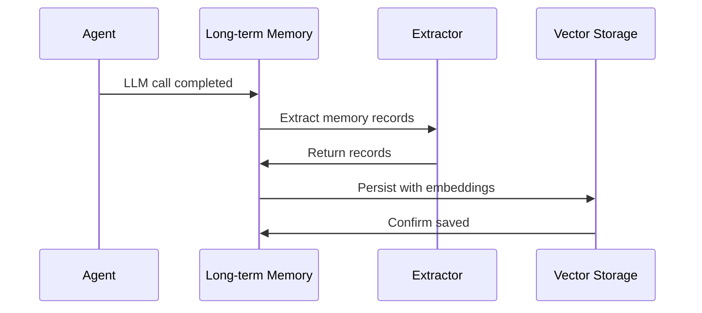

<Warning>
  This feature is **experimental** and may change in future releases.
</Warning>

Long-term Memory provides persistent storage of memory records (documents) in vector databases, enabling Retrieval-Augmented Generation (RAG) and knowledge persistence across agent sessions.

## What is Long-term Memory?

Long-term Memory enables two key capabilities:

1. **Retrieval (RAG)**: Retrieve relevant context from stored memories using vector similarity search and inject it into prompts
2. **Ingestion**: Persist messages and documents to memory for future retrieval

Unlike short-term [Memory](/features/memory) which stores structured facts, Long-term Memory uses vector embeddings for semantic search over unstructured content.

## Installation

```kotlin
import ai.koog.agents.longtermmemory.feature.LongTermMemory
import ai.koog.agents.core.annotation.ExperimentalAgentsApi

@OptIn(ExperimentalAgentsApi::class)
val agent = AIAgent(
    executor = myExecutor,
    strategy = myStrategy
) {
    install(LongTermMemory) {
        // Configure retrieval (RAG)
        retrieval {
            storage = myRetrievalStorage
            searchStrategy = SimilaritySearchStrategy(topK = 5)
            promptAugmenter = SystemPromptAugmenter()
        }
        
        // Configure ingestion (persistence)
        ingestion {
            storage = myIngestionStorage
            extractor = FilteringMemoryRecordExtractor(
                messageRolesToExtract = setOf(Message.Role.User, Message.Role.Assistant)
            )
            timing = IngestionTiming.ON_LLM_CALL
        }
    }
}
```

## Configuration

### Retrieval Settings

Controls how memories are retrieved and injected into prompts:

```kotlin
import ai.koog.agents.longtermmemory.retrieval.SearchStrategy
import ai.koog.agents.longtermmemory.retrieval.augmentation.UserPromptAugmenter

retrieval {
    // Storage for searching memories (required)
    storage = myRetrievalStorage
    
    // Search strategy (required)
    searchStrategy = SimilaritySearchStrategy(topK = 5)
    
    // How to inject retrieved context (optional, defaults to SystemPromptAugmenter)
    promptAugmenter = UserPromptAugmenter()
}
```

| Property | Type | Required | Description |
|----------|------|----------|-------------|
| `storage` | `RetrievalStorage` | Yes | Vector storage for searching |
| `searchStrategy` | `SearchStrategy` | Yes | How to search for relevant memories |
| `promptAugmenter` | `PromptAugmenter` | No | Where to inject context (default: system prompt) |

### Ingestion Settings

Controls how messages are persisted to memory:

```kotlin
import ai.koog.agents.longtermmemory.ingestion.IngestionTiming
import ai.koog.agents.longtermmemory.ingestion.extraction.FilteringMemoryRecordExtractor

ingestion {
    // Storage for persisting memories (required)
    storage = myIngestionStorage
    
    // How to extract records from messages (optional)
    extractor = FilteringMemoryRecordExtractor(
        messageRolesToExtract = setOf(Message.Role.User)
    )
    
    // When to save (optional, defaults to ON_LLM_CALL)
    timing = IngestionTiming.ON_LLM_CALL
}
```

| Property | Type | Required | Description |
|----------|------|----------|-------------|
| `storage` | `IngestionStorage` | Yes | Storage for persisting memories |
| `extractor` | `MemoryRecordExtractor` | No | How to transform messages to records |
| `timing` | `IngestionTiming` | No | When to save (default: `ON_LLM_CALL`) |

### Ingestion Timing

Control when messages are saved:

```kotlin
import ai.koog.agents.longtermmemory.ingestion.IngestionTiming

// Save after each LLM call (default)
timing = IngestionTiming.ON_LLM_CALL

// Save once at agent completion
timing = IngestionTiming.ON_AGENT_COMPLETION
```

## Storage Implementations

### In-Memory Storage

For testing and development:

```kotlin
import ai.koog.agents.longtermmemory.storage.InMemoryRecordStorage

val storage = InMemoryRecordStorage()

install(LongTermMemory) {
    retrieval {
        storage = storage
        searchStrategy = SimilaritySearchStrategy(topK = 3)
    }
    ingestion {
        storage = storage
    }
}
```

<Note>
  In-memory storage is lost when the application restarts. Use persistent storage for production.
</Note>

### Custom Storage

Implement your own storage backend:

```kotlin
import ai.koog.agents.longtermmemory.retrieval.RetrievalStorage
import ai.koog.agents.longtermmemory.ingestion.IngestionStorage
import ai.koog.agents.longtermmemory.model.MemoryRecord

class MyVectorStorage : RetrievalStorage, IngestionStorage {
    override suspend fun search(
        request: SearchRequest,
        namespace: String?
    ): List<MemoryRecord> {
        // Implement vector similarity search
        // Example: Query your vector database (Pinecone, Weaviate, etc.)
        // and return matching memory records
        return emptyList() // Replace with actual implementation
    }
    
    override suspend fun add(
        records: List<MemoryRecord>,
        namespace: String?
    ) {
        // Persist records with embeddings
        // Example: Generate embeddings and store in vector database
        // records.forEach { record -> vectorDB.insert(record, namespace) }
    }
}
```

## Search Strategies

### Similarity Search

Find top-k most similar memories:

```kotlin
import ai.koog.agents.longtermmemory.retrieval.SearchStrategy

searchStrategy = SimilaritySearchStrategy(
    topK = 5,  // Return 5 most similar results
    minScore = 0.7  // Optional minimum similarity threshold
)
```

### Custom Search Strategy

Implement custom search logic:

```kotlin
import ai.koog.agents.longtermmemory.retrieval.SearchStrategy
import ai.koog.agents.longtermmemory.retrieval.SearchRequest

class MySearchStrategy : SearchStrategy {
    override fun create(query: String): SearchRequest {
        return SearchRequest(
            query = query,
            topK = 10,
            filters = mapOf("category" to "technical")
        )
    }
}

searchStrategy = MySearchStrategy()
```

## Prompt Augmentation

### System Prompt Augmenter (Default)

Injects retrieved context into the system prompt:

```kotlin
import ai.koog.agents.longtermmemory.retrieval.augmentation.SystemPromptAugmenter

prompAugmenter = SystemPromptAugmenter()
```

**Result**:
```
System: You are a helpful assistant.

Relevant context from memory:
- Memory record 1
- Memory record 2

User: What is Kotlin?
```

### User Prompt Augmenter

Injects retrieved context near the user's message:

```kotlin
import ai.koog.agents.longtermmemory.retrieval.augmentation.UserPromptAugmenter

promptAugmenter = UserPromptAugmenter()
```

**Result**:
```
System: You are a helpful assistant.

User: What is Kotlin?

Relevant context:
- Memory record 1
- Memory record 2
```

### Custom Augmenter

Implement custom prompt augmentation:

```kotlin
import ai.koog.agents.longtermmemory.retrieval.augmentation.PromptAugmenter
import ai.koog.prompt.dsl.Prompt

class MyAugmenter : PromptAugmenter {
    override fun augment(
        originalPrompt: Prompt,
        relevantContext: List<MemoryRecord>
    ): Prompt {
        // Custom augmentation logic
        return originalPrompt.copy(
            messages = buildList {
                addAll(originalPrompt.messages)
                add(Message.User("Context: ${relevantContext.joinToString()}"))
            }
        )
    }
}

promptAugmenter = MyAugmenter()
```

## Memory Record Extractors

### Filtering Extractor

Filter messages by role:

```kotlin
import ai.koog.agents.longtermmemory.ingestion.extraction.FilteringMemoryRecordExtractor
import ai.koog.prompt.message.Message

extractor = FilteringMemoryRecordExtractor(
    messageRolesToExtract = setOf(
        Message.Role.User,
        Message.Role.Assistant
    )
)
```

### Custom Extractor

Implement custom extraction logic:

```kotlin
import ai.koog.agents.longtermmemory.ingestion.extraction.MemoryRecordExtractor
import ai.koog.agents.longtermmemory.model.MemoryRecord

extractor = MemoryRecordExtractor { messages ->
    messages
        .filter { it.role == Message.Role.Assistant }
        .map { message ->
            MemoryRecord.Plain(
                content = message.content,
                metadata = mapOf(
                    "role" to message.role.name,
                    "timestamp" to System.currentTimeMillis()
                )
            )
        }
}
```

## Usage in Strategy Nodes

Access long-term memory storage from within nodes:

```kotlin
import ai.koog.agents.longtermmemory.feature.withLongTermMemory
import ai.koog.agents.longtermmemory.model.MemoryRecord

val searchMemory by node<String, List<MemoryRecord>> { query ->
    withLongTermMemory {
        // Access retrieval storage
        val results = retrievalStorage?.search(
            SearchRequest(query = query, topK = 5),
            namespace = "my-knowledge-base"
        ) ?: emptyList()
        
        results
    }
}

val saveToMemory by node<String, Unit> { content ->
    withLongTermMemory {
        // Access ingestion storage
        ingestionStorage?.add(
            records = listOf(
                MemoryRecord.Plain(
                    content = content,
                    metadata = mapOf("source" to "manual")
                )
            ),
            namespace = "my-knowledge-base"
        )
    }
}
```

## Namespaces

Organize memories into logical collections:

```kotlin
// Store in different namespaces
ingestionStorage.add(
    records = technicalDocs,
    namespace = "technical-documentation"
)

ingestionStorage.add(
    records = userQueries,
    namespace = "user-queries"
)

// Search specific namespace
val results = retrievalStorage.search(
    request = searchRequest,
    namespace = "technical-documentation"
)
```

## Complete Example

```kotlin
import ai.koog.agents.core.dsl.graphStrategy
import ai.koog.agents.longtermmemory.feature.LongTermMemory
import ai.koog.agents.longtermmemory.storage.InMemoryRecordStorage
import ai.koog.agents.longtermmemory.retrieval.SearchStrategy
import ai.koog.agents.longtermmemory.ingestion.IngestionTiming
import ai.koog.agents.core.annotation.ExperimentalAgentsApi

@OptIn(ExperimentalAgentsApi::class)
val agent = AIAgent(
    executor = openAIExecutor,
    llmModel = OpenAIModels.Chat.GPT4o,
    strategy = graphStrategy {
        val processQuery by node<String, String> { query ->
            // LLM automatically gets relevant context from long-term memory
            requestLLM(query)
        }
        
        edges {
            start goesTo processQuery
            processQuery goesTo finish
        }
    }
) {
    install(LongTermMemory) {
        val storage = InMemoryRecordStorage()
        
        // Enable RAG: retrieve relevant context
        retrieval {
            this.storage = storage
            searchStrategy = SimilaritySearchStrategy(topK = 3)
        }
        
        // Enable persistence: save conversations
        ingestion {
            this.storage = storage
            extractor = FilteringMemoryRecordExtractor(
                messageRolesToExtract = setOf(
                    Message.Role.User,
                    Message.Role.Assistant
                )
            )
            timing = IngestionTiming.ON_LLM_CALL
        }
    }
}

// First run: ask a question and save to memory
val result1 = agent.run("What is Kotlin?")

// Second run: benefits from first conversation in memory
val result2 = agent.run("Tell me more about its features")
```

## How It Works

### Retrieval Flow



### Ingestion Flow



## Best Practices

<AccordionGroup>
  <Accordion title="Choose appropriate timing">
    Use `ON_LLM_CALL` for frequent updates or `ON_AGENT_COMPLETION` to reduce storage operations.
  </Accordion>
  
  <Accordion title="Filter ingested messages">
    Only save relevant messages (User, Assistant) to reduce noise and storage costs.
  </Accordion>
  
  <Accordion title="Use namespaces">
    Organize memories by domain or use case to improve retrieval accuracy.
  </Accordion>
  
  <Accordion title="Tune search parameters">
    Adjust `topK` and similarity thresholds based on your use case. Start with 3-5 results.
  </Accordion>
  
  <Accordion title="Monitor storage growth">
    Implement cleanup policies for old or irrelevant memories to manage storage costs.
  </Accordion>
</AccordionGroup>

<Warning>
  **Performance**: Vector search can be expensive. Use appropriate storage backends and consider caching for production use.
</Warning>

## Related Features

<CardGroup cols={2}>
  <Card title="Memory" icon="brain" href="/features/memory">
    Short-term structured memory for facts during execution
  </Card>
  <Card title="Persistence" icon="floppy-disk" href="/features/persistence">
    Save and restore complete agent state
  </Card>
</CardGroup>
