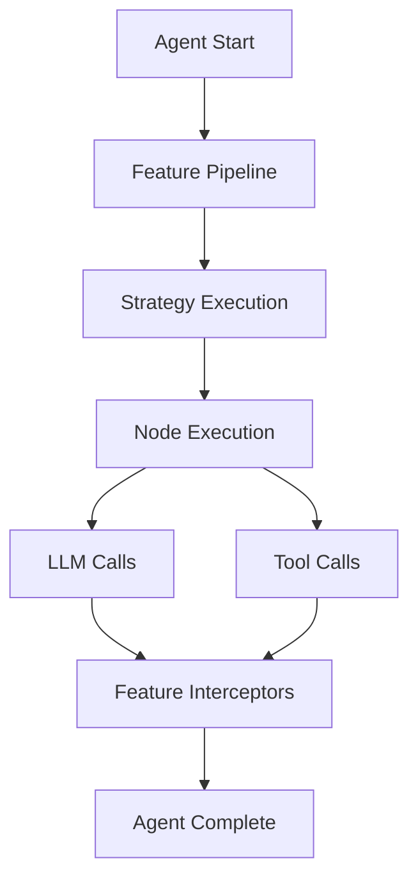

Koog provides a rich set of installable features that extend agent capabilities. Features integrate seamlessly into the agent lifecycle through a pipeline architecture, allowing you to add functionality like memory, tracing, event handling, and persistence.

## Available Features

### Memory & State

<CardGroup cols={2}>
  <Card title="Memory" icon="brain" href="/features/memory">
    Short-term conversation memory for storing and retrieving facts during agent execution
  </Card>
  <Card title="Long-term Memory" icon="database" href="/features/longterm-memory">
    Persistent memory with vector search (RAG) for storing knowledge across sessions
  </Card>
  <Card title="Persistence" icon="floppy-disk" href="/features/persistence">
    Save and restore complete agent state with checkpoints
  </Card>
</CardGroup>

### Observability

<CardGroup cols={2}>
  <Card title="Event Handlers" icon="webhook" href="/features/event-handlers">
    Hook into agent lifecycle events for custom logic
  </Card>
  <Card title="Tracing" icon="chart-line" href="/features/tracing">
    Comprehensive execution tracing for debugging and analysis
  </Card>
  <Card title="OpenTelemetry" icon="tower-broadcast" href="/features/opentelemetry">
    Industry-standard observability with OpenTelemetry integration
  </Card>
</CardGroup>

### Optimization

<Card title="History Compression" icon="compress" href="/features/history-compression">
  Intelligent conversation history compression to manage context limits
</Card>

## Installation Pattern

All features follow a consistent installation pattern:

```kotlin
val agent = AIAgent(
    executor = myExecutor,
    llmModel = OpenAIModels.Chat.GPT4o,
    strategy = myStrategy
) {
    install(FeatureName) {
        // Feature-specific configuration
    }
}
```

## Feature Architecture

Features integrate with the agent through the **pipeline architecture**:



### Feature Capabilities

Features can:

- **Intercept Events**: Hook into agent lifecycle events
- **Transform Data**: Modify prompts, messages, and results
- **Store State**: Maintain feature-specific storage
- **Add Context**: Inject information into agent execution

## Multiplatform Support

All features are built on Kotlin Multiplatform and support:

- **JVM** (Java 17+)
- **JavaScript** (Node.js and Browser)
- **WASM** (WebAssembly)

<Note>
  Platform-specific features (like file-based storage) may have different implementations across targets.
</Note>

## Combining Features

Features are designed to work together seamlessly:

```kotlin
val agent = AIAgent(...) {
    // Memory for storing facts
    install(AgentMemory) {
        memoryProvider = LocalFileMemoryProvider(...)
        productName = "my-ide"
    }
    
    // Events for monitoring
    install(EventHandler) {
        onToolCallStarting { ctx ->
            println("Tool: ${ctx.toolName}")
        }
    }
    
    // Tracing for debugging
    install(Tracing) {
        addMessageProcessor(TraceFeatureMessageLogWriter())
    }
    
    // Persistence for recovery
    install(AgentCheckpoint) {
        snapshotProvider(FileAgentCheckpointStorageProvider())
        continuouslyPersistent()
    }
}
```

## Feature Lifecycle

Features participate in the complete agent lifecycle:

1. **Installation**: Feature is configured and installed
2. **Agent Starting**: Feature initializes for a new run
3. **Strategy Starting**: Feature prepares for strategy execution
4. **Node Execution**: Feature intercepts node processing
5. **LLM/Tool Calls**: Feature monitors or modifies calls
6. **Strategy Complete**: Feature finalizes strategy work
7. **Agent Complete**: Feature cleans up and persists state

## Best Practices

<AccordionGroup>
  <Accordion title="Start with essential features">
    Begin with Memory and Event Handlers for most use cases. Add tracing and persistence as needed.
  </Accordion>
  
  <Accordion title="Configure scope appropriately">
    Use the right scope (Agent, Feature, Product, Organization) for memory to control visibility.
  </Accordion>
  
  <Accordion title="Monitor performance impact">
    Features like tracing and persistence can impact performance. Use sampling or filtering in production.
  </Accordion>
  
  <Accordion title="Handle feature dependencies">
    Some features work better together. For example, Memory + LongTermMemory provides both short and long-term recall.
  </Accordion>
</AccordionGroup>

## Next Steps

<CardGroup cols={2}>
  <Card title="Memory" icon="brain" href="/features/memory">
    Add short-term memory to your agent
  </Card>
  <Card title="Event Handlers" icon="webhook" href="/features/event-handlers">
    Hook into lifecycle events
  </Card>
  <Card title="Tracing" icon="chart-line" href="/features/tracing">
    Debug with execution traces
  </Card>
  <Card title="OpenTelemetry" icon="tower-broadcast" href="/features/opentelemetry">
    Production-grade observability
  </Card>
</CardGroup>
