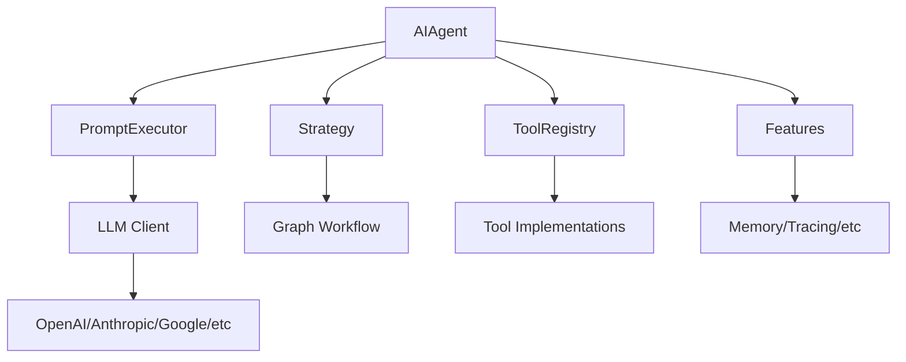

## What is Koog?

Koog is a Kotlin-based framework designed to build and run AI agents entirely in idiomatic Kotlin. It lets you create agents that can interact with tools, handle complex workflows, and communicate with users across multiple platforms.

Built by JetBrains, Koog brings type-safety, coroutines, and the full power of Kotlin to AI agent development.

<Note>
  Koog is currently in **Alpha** stage. The API is stabilizing but may still undergo changes.
</Note>

## Why Choose Koog?

Koog stands out from other agent frameworks by leveraging Kotlin's strengths:

<CardGroup cols={2}>
  <Card title="Type-Safe DSL" icon="shield-check">
    Build agents with an idiomatic Kotlin DSL that catches errors at compile-time, not runtime.
  </Card>
  <Card title="Multiplatform Ready" icon="globe">
    Deploy the same agent code to JVM, JavaScript, WasmJS, Android, and iOS.
  </Card>
  <Card title="Production-Grade" icon="building">
    Built-in fault tolerance, state persistence, and enterprise integrations for Spring Boot and Ktor.
  </Card>
  <Card title="Developer-Friendly" icon="code">
    Leverage coroutines for async operations and enjoy full IDE support with IntelliJ IDEA.
  </Card>
</CardGroup>

## Key Features

### Graph-Based Workflows

Define agent behavior as a state machine with nodes and edges. This makes complex multi-step workflows explicit and debuggable:

```kotlin
val strategy = strategy<String, String>("calculator") {
    val nodeCallLLM by nodeLLMRequestMultiple()
    val nodeExecuteTools by nodeExecuteMultipleTools()
    val nodeSendResults by nodeLLMSendMultipleToolResults()
    
    edge(nodeStart forwardTo nodeCallLLM)
    edge(nodeCallLLM forwardTo nodeExecuteTools onMultipleToolCalls { true })
    edge(nodeExecuteTools forwardTo nodeSendResults)
    edge(nodeSendResults forwardTo nodeFinish onAssistantMessage { true })
}
```

### Reliability & Fault Tolerance

- **Automatic Retries**: Built-in retry logic for LLM API calls and tool executions
- **State Persistence**: Save and restore agent state at specific execution points
- **Checkpointing**: Resume long-running tasks after failures
- **Error Handling**: Comprehensive error reporting with detailed tracing

### Intelligent History Management

Optimize token usage while maintaining context:

- **Automatic Compression**: Compress conversation history when token limits are approached
- **Configurable Strategies**: Choose between summarization, windowing, or custom compression
- **Context Preservation**: Keep important messages while reducing token count

### LLM Provider Flexibility

Switch between providers seamlessly without losing conversation context:

<CardGroup cols={3}>
  <Card title="OpenAI" icon="robot">
    GPT-4, GPT-4o, GPT-3.5
  </Card>
  <Card title="Anthropic" icon="message-bot">
    Claude 3 and Claude 4 models
  </Card>
  <Card title="Google" icon="google">
    Gemini 1.5 Pro and Flash
  </Card>
  <Card title="Ollama" icon="server">
    Local open-source models
  </Card>
  <Card title="DeepSeek" icon="magnifying-glass">
    DeepSeek models
  </Card>
  <Card title="Others" icon="plus">
    OpenRouter, Bedrock, Mistral
  </Card>
</CardGroup>

### Enterprise Integration

- **Spring Boot Starter**: Drop-in integration for Spring Boot applications
- **Ktor Support**: Native support for Ktor server applications
- **OpenTelemetry**: Built-in observability with W&B Weave, Langfuse, and custom exporters
- **Database Persistence**: SQL-based persistence with Exposed ORM

### Advanced Capabilities

<AccordionGroup>
  <Accordion title="Model Context Protocol (MCP)">
    Integrate with MCP servers to access external tools and data sources. Use tools from the MCP ecosystem directly in your agents.
  </Accordion>
  
  <Accordion title="Agent Client Protocol (ACP)">
    Build ACP-compliant agents that can communicate with standardized client applications and other agents.
  </Accordion>
  
  <Accordion title="Vector Embeddings & RAG">
    Add long-term memory to agents using vector storage and retrieval-augmented generation (RAG) patterns.
  </Accordion>
  
  <Accordion title="Streaming Responses">
    Process LLM responses in real-time with streaming support, including parallel tool call execution.
  </Accordion>
  
  <Accordion title="Custom Tools">
    Create type-safe tools using Kotlin annotations. Tools integrate seamlessly with the agent execution environment.
  </Accordion>
  
  <Accordion title="Comprehensive Testing">
    Mock LLM responses and tool behaviors with the built-in testing framework. Test graph structures without making API calls.
  </Accordion>
</AccordionGroup>

## Architecture Overview

Koog is built on a modular architecture with clear separation of concerns:



### Core Components

- **AIAgent**: The main orchestrator that manages the agent lifecycle
- **PromptExecutor**: Handles communication with LLM providers
- **Strategy**: Defines the agent's behavior as a graph of nodes and edges
- **ToolRegistry**: Manages available tools and their execution
- **Features**: Modular capabilities like memory, tracing, and persistence

## Use Cases

Koog is ideal for:

- **Task Automation**: Agents that execute multi-step workflows with tool calls
- **Customer Support**: Conversational agents with access to knowledge bases
- **Code Analysis**: Agents that read, analyze, and modify code
- **Data Processing**: Agents that extract, transform, and analyze data
- **Research Assistants**: Agents that search, summarize, and synthesize information
- **API Integration**: Agents that interact with external services and APIs

## Getting Started

Ready to build your first agent? Follow these guides:

<CardGroup cols={2}>
  <Card title="Quickstart" icon="rocket" href="/quickstart">
    Build your first agent in 5 minutes
  </Card>
  <Card title="Installation" icon="download" href="/installation">
    Add Koog to your Kotlin project
  </Card>
  <Card title="Core Concepts" icon="book" href="/concepts/agents">
    Understand the fundamentals
  </Card>
  <Card title="Examples" icon="code" href="/examples/overview">
    Explore real-world examples
  </Card>
</CardGroup>

## Community

Join the Koog community:

- **Slack**: [Join our Slack channel](https://docs.koog.ai/koog-slack-channel/) for discussions and support
- **GitHub**: [Star and contribute on GitHub](https://github.com/JetBrains/koog)
- **Issue Tracker**: [Report bugs on YouTrack](https://youtrack.jetbrains.com/issues/KG)

## Next Steps

<Steps>
  <Step title="Install Koog">
    Follow the [installation guide](/installation) to add Koog to your project
  </Step>
  <Step title="Build Your First Agent">
    Complete the [quickstart tutorial](/quickstart) to create a working agent
  </Step>
  <Step title="Learn Core Concepts">
    Read about [agents](/concepts/agents), [tools](/concepts/tools), and [strategies](/concepts/strategies)
  </Step>
  <Step title="Explore Examples">
    Browse the [examples](/examples/overview) to see patterns and best practices
  </Step>
</Steps>